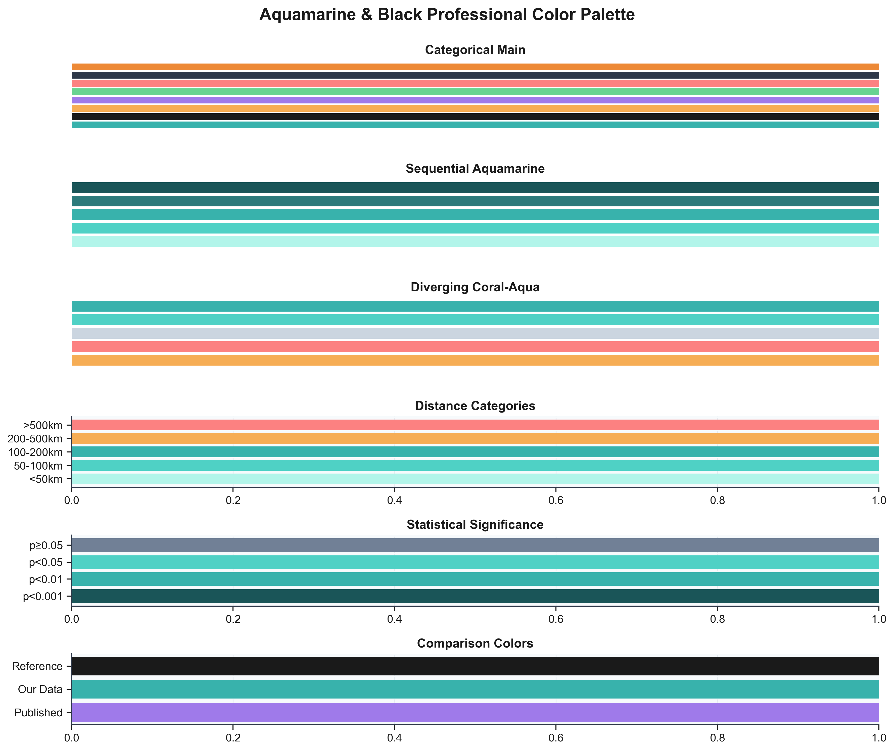

# 🧠 DBS Access Disparity Dashboard

**Geographic and Socioeconomic Analysis of Deep Brain Stimulation Access in Canada (2019-2023)**

[](https://ramihatou97.github.io/DBS/)
[](LICENSE)

## 📊 Overview

This interactive dashboard presents a comprehensive analysis of **936 Deep Brain Stimulation (DBS) procedures** performed across Canada from 2019 to 2023, examining geographic, socioeconomic, and demographic factors that influence patient access to this critical neurological treatment.

**[🌐 View Live Dashboard](https://ramihatou97.github.io/DBS/)**

---

## 🎯 Key Findings

### Geographic Disparity
- **10.09× disparity ratio** for patients from areas with >10% Indigenous ancestry
- Mean driving distance: **72.6 km** (<1% Indigenous) → **731.9 km** (>10% Indigenous)

### Provincial Variation
- **Ontario**: 1.88× national rate (676 cases) - Highest access ***
- **British Columbia**: 0.03× national rate (4 cases) - Critical underutilization ***
- **Manitoba**: 0.06× national rate (2 cases) - Severe access barrier ***

### Statistical Significance
- **Indigenous ancestry**: Strongest predictor (p < 0.001)
- **Rural status**: Significant positive effect (p < 0.01)
- **Median income**: Moderate negative effect (p < 0.05)

---

## 📁 Repository Contents

### 📈 Visualizations

#### **Figure 1: Geographic Distribution Series**
- `Figure1A_Geographic_Distribution_Basic.png` - Basic geographic distribution (936 cases)
- `Figure1B_Geographic_Density_Heatmap.png` - Patient density heatmap
- `Figure1C_Provincial_Proportional_Circles.png` - Provincial case counts
- `Figure1D_Temporal_Evolution.png` - Year-by-year evolution (2019-2023)
- `Figure1E_Age_Distribution_Geography.png` - Age distribution by region
- `Figure1F_Rural_vs_Urban.png` - Rural vs urban access patterns

#### **Figure 3: Provincial Comparison Series**
- `Figure3_WITH_CONFIDENCE_INTERVALS.png` - Provincial rate ratios with 95% CI
- `Figure3_SIDE_BY_SIDE_WITH_CI.png` - Comparison with published data
- `Figure3_FOREST_PLOT_WITH_CI.png` - Forest plot style visualization

#### **Main Analytical Figures** (`figures/` directory)
1. `Fig1_Indigenous_Disparity_Gradient.png` - Indigenous disparity analysis
2. `Fig2_Regression_Coefficients.png` - Statistical regression results
3. `Fig3_Provincial_Comparison.png` - Four-panel provincial analysis
4. `Fig4_Interaction_Effect.png` - Indigenous × Rural interaction
5. `Fig5_Distance_Distribution.png` - Distance distribution analysis
6. `Fig6_Scatterplot_Matrix.png` - Variable relationship matrix
7. `Fig7_Model_Diagnostics.png` - Regression diagnostics
8. `Fig8_Demographics.png` - Patient demographics
9. `Fig9_Socioeconomic_Indicators.png` - Socioeconomic analysis
10. `Fig10_Correlation_Matrix.png` - Correlation heatmap

### 🗺️ Interactive Maps

- `map_current_patient_flows_nov2025.html` - Main patient flow visualization
- `maps_nov2025/` - Additional interactive maps including:
  - Travel burden heatmap
  - Vulnerability index
  - Indigenous access crisis map
  - Animated patient flows
  - Individual patient distributions

### 💻 Code & Scripts

- `color_palette.py` - Professional aquamarine & black color palette
- `create_visualizations.py` - Main visualization suite generator
- `generate_figure1_ultradetailed.py` - Geographic visualization generator
- `generate_figure3_with_CI.py` - Provincial comparison generator
- Python scripts in `maps_nov2025/` for interactive map generation

### 📄 Documentation

- `COLOR_SCHEME_UPDATE_SUMMARY.md` - Complete color palette documentation
- `README.md` - This file

---

## 🎨 Design & Color Scheme

This dashboard uses a **professional aquamarine and charcoal** color palette for optimal clarity and visual appeal:

- **Primary Aquamarine**: `#38B2AC` - Main data visualization
- **Charcoal**: `#1A1A1A` - Text, borders, contrast
- **Coral Accent**: `#F6AD55` - Warm contrast elements
- **Lavender Accent**: `#9F7AEA` - Cool categorical distinction

All visualizations are generated at **300 DPI** for publication quality.

---

## 🚀 Quick Start

### View the Dashboard

Simply visit: **[https://ramihatou97.github.io/DBS/](https://ramihatou97.github.io/DBS/)**

### Run Locally

```bash
# Clone the repository
git clone https://github.com/ramihatou97/DBS.git
cd DBS

# Open the dashboard
open index.html
# or
python3 -m http.server 8000
# then visit http://localhost:8000
```

### Regenerate Visualizations

```bash
# Install dependencies
pip install pandas numpy matplotlib seaborn scipy

# Generate all visualizations
python3 create_visualizations.py
python3 generate_figure1_ultradetailed.py
python3 generate_figure3_with_CI.py
```

---

## 📊 Dataset

- **936 DBS procedures** from Canadian centers (2019-2023)
- De-identified patient records
- Statistics Canada 2021 Census data (socioeconomic variables)
- Forward Sortation Area (FSA) level geographic analysis
- Driving distance calculations via Google Maps API

### Key Variables

| Category | Variables |
|----------|-----------|
| **Primary Outcome** | Driving distance to nearest DBS center (km) |
| **Main Predictors** | Indigenous ancestry %, median income, Gini index, rural status |
| **Demographics** | Age, sex, indication (PD, ET, dystonia) |
| **Geographic** | Province/territory, FSA, rural/urban classification |

---

## 📈 Statistical Methods

- **Multivariate linear regression** (log-transformed distance)
- **Poisson regression** for rate ratio calculations
- **95% confidence intervals** using exact Poisson methods
- **VIF analysis** for multicollinearity assessment
- **Model diagnostics** (residuals, Q-Q plots, Cook's distance)

---

## 🛠️ Technologies Used

### Data Analysis
- **Python 3.9+**
- **pandas** - Data manipulation
- **numpy** - Numerical computing
- **scipy** - Statistical analysis
- **statsmodels** - Regression modeling

### Visualization
- **matplotlib** - Static visualizations
- **seaborn** - Statistical graphics
- **Google Maps API** - Interactive maps
- **Folium** - Web mapping

### Web Dashboard
- **HTML5/CSS3** - Responsive design
- **JavaScript (ES6)** - Interactive features
- **GitHub Pages** - Hosting

---

## 📝 Citation

If you use this dashboard or analysis in your research, please cite:

```bibtex
@misc{dbs_disparity_2025,
  title={Deep Brain Stimulation Access Disparity Dashboard: Geographic and Socioeconomic Analysis in Canada},
  author={[Your Name]},
  year={2025},
  howpublished={\url{https://github.com/ramihatou97/DBS}},
  note={Accessed: [Date]}
}
```

---

## 📄 License

This project is licensed under the MIT License - see the [LICENSE](LICENSE) file for details.

---

## 👥 Contributing

Contributions are welcome! Please feel free to submit a Pull Request.

### Development Setup

```bash
# Clone repository
git clone https://github.com/ramihatou97/DBS.git
cd DBS

# Install Python dependencies
pip install -r requirements.txt

# Make your changes

# Test visualizations
python3 create_visualizations.py

# Create pull request
```

---

## 🔗 Links

- **Live Dashboard**: [https://ramihatou97.github.io/DBS/](https://ramihatou97.github.io/DBS/)
- **GitHub Repository**: [https://github.com/ramihatou97/DBS](https://github.com/ramihatou97/DBS)
- **Issues**: [https://github.com/ramihatou97/DBS/issues](https://github.com/ramihatou97/DBS/issues)

---

## 📧 Contact

For questions or collaborations, please open an issue on GitHub.

---

## 🙏 Acknowledgments

- Statistics Canada for providing 2021 Census data
- DBS centers across Canada for data contributions
- Open-source community for visualization tools

---

<p align="center">
  <strong>Made with ❤️ and Python</strong><br>
  Professional Aquamarine & Black Design • 300 DPI Quality • Interactive Maps
</p>

<p align="center">
  
</p>

---

**Last Updated**: November 6, 2025
